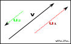

# Álgebra Linear
Conteúdo básico e simplificado de álgebra linear.  
Fonte: [UFRJ](https://ic.ufrj.br/~collier/lectures/ala.pdf)

## Sumário  
1. [Introdução e conceitos Básicos](#Introdução_e_conceitos_Básicos) 
2. [Projeções Ortogonais](#Projeções_Ortogonais)

## Definições
#### Módulo, norma ou comprimento
- Valor escalar denotado por $||v||$. *"Se imaginar uma estrada reta infinita indo do leste ao oeste, o comprimento seria a <ins>distância percorrida</ins>"*  

#### Direção
- A reta imaginária onde o vetor se encontra. *"Na mesma estrada reta infinita a <ins>direção é a própria estrada</ins> independente de ir para esqueda ou direita"*  

#### Sentido
- lado que o vetor segue dentro da reta imaginária. *"Na mesma estrada reta infinita o <ins>sentido é o lado que você segue</ins>. Por exemplo é a mão ou a contramão quando você viaja de carro."*  

#### Origem
- O ponto inicial onde <ins>consideramos a origem do vetor</ins>, simbolizado por "$O$".  
    - A origem é um ponto que determinamos na álgebra linear.  

#### Vetor unitário
- O vetor que possui *[módulo](#módulo-ou-norma) é igual a 1*.  
    - Representa somente a <ins>*[direção](#direção)*</ins> e <ins>*[sentido](#sentido)*</ins>. 
    - *"Podemos imaginar o Vetor unitário como uma seta que apenas <ins>indica o caminho</ins>"*
    - Seu valor é dado pelo <ins>*vetor divido pelo módulo*</ins>:  
    $$u=\frac{v}{||{v}||}$$

    - ***Calculando o vetor unitário:***  
        - Imagine um vetor na posição $v=(3, 4)$ no plano:  
        - O valor de $||v||$ será:  
        $$||v||=\sqrt{(3^2+4^2)} = \sqrt{(9+16)} = \sqrt{25} = 5 $$
        - Em seguida dividimos o vetor $v$ pelo seu módulo $||v||$:
        $$u=\frac{v}{||{v}||} = (\frac{3}{5},\frac{4}{5}) = (0.6, 0.8)$$
        - Confirmando que $(0.6,0.8)$ é o vetor unitário:  
        $$||u|| = \sqrt{(0.6)^2+(0.8)^2} = \sqrt{0.36+0.64} = \sqrt{1} = 1$$
        - Logo, $(0.6, 0.8)$ é o vetor unitário de $(3, 4)$  

#### Projeção ortogonal
- É um componente que representa a sombra que projeta $v$ na direção de $u$.
    - O comprimento desse vetor projeção é dado por:
     $$Proj_{\mathbf{u}}(v) = ∥v∥ · | cos \theta|$$
    
#### Vetores colineares
- São vetores que possuem a mesma [direção](#direção), ou seja, se sobrepor os vetores, eles seráo ***paralelos***
  
- Para saber se são colineares basta multiplicar de forma cruzada os vetores. O resultado deverá ser o mesmo.
    - No caso do vetor $v=(2,6)$ e $u=(3,9)$  
    $$(2 \cdot 9) = (6 \cdot 3) $$
- Outra forma de descobrir se os vetores são colineares é reduzir os vetores a forma $u=k \cdot v$ onde $\exists x \in \mathbb{R}$  
    - No caso do vetor $v=(2,6)$ e $u=(3,9)$  é o mesmo que $v=\frac{2}{3}u$
    $$ v=\frac{2}{3}u = \frac{2}{3}(3,9) = ((\frac{2}{3} \cdot 3), (\frac{2}{3} \cdot 9)) = (2,6)$$

## Introdução e Conceitos Básicos
- Um **<ins>Vetor<ins>** é um segmento de reta orientado que possui [comprimento](#módulo-norma-ou-comprimento), [direção](#direção) e [sentido](#sentido).

### Operações com Vetores
- <ins>**Soma de vetores**</ins> - Usa a [Regra do Paralelogramo](https://pt.wikipedia.org/wiki/Regra_do_paralelogramo):  
        $$(a+b)^2 = a^2 + b^2 + 2 \cdot a \cdot b \cdot \cos \theta$$  
  

- <ins>**Subtração de vetores**</ins> - é dado por $a$ - $b$. Para obter $-b$ basta inverter o seu [sentido](#sentido).  
  

    - *Atenção*: $a-b$ é diferente de $b-a$  
    - EXEMPLO:  
        - dado vetor $a=(2,3)$ e $b=(1,2)$, $a-b$ será:  
        $$-b=-(1,2)=(-1,-2)$$
        $$a-b = (2,3) + (-1,-2) = ((2-1),(3-2))=(1,1)$$
        - Agora no caso de $b-a$ o resultado será:  
        $$-a=-(2,3)=(-2,-3)$$
        $$b-a = (1,2) + (-2,-3) = ((1-2),(2-3))=(-1,-1)$$

- As operações de soma e subtração ainda podem ser simplificadas como uma operação de multiplicação de um vetor $λ$ e o vetor $v$.  
    - A generalização para $λ$ só é válida se obedecer as seguintes regras:  
        - *$1 \cdot v = v$*; 
        - *$0 \cdot v = 0$*;
        - *$λ ∈ \mathbb{R}$*
        - *$λ(u + v) = λu + λv$*;
            - com *$λ ∈ \mathbb{R}$*
        - *$(λ + µ)u = λu + µu$*;
            - com *$µ ∈ \mathbb{R}$*
        - *$(λµ)u = λ(µu)$*;
    - Dado o os vetor $u=(2,5)$ e $v=(3,−1)$:
        - A soma será:
        $$u+v=(1 \cdot u) +(1 \cdot v)$$
        - A subtração será:
        $$u-v=(1 \cdot u) +(-1 \cdot v)$$

### Projeções Ortogonais
- Caso posicionemos um vetor $v$ em cima de um vetor $u$, podemos criar uma sombra de $v$ em $u$, ou *<ins>[projeção ortogonal](#projeção-ortogonal)</ins>*.
    - Sua fórmula é:
    
     $$ Proj_{\mathbf{u}}(v) = ∥v∥ · | cos \theta|$$
    - Observações quanto ao ângulo $\theta$ formado entre os vetores $v$ e $u$:
        - Caso $\cos \theta > 0$ o ângulo é agudo ($<90°$) e mesmo sentido que $u$
        - Caso $\cos \theta < 0$ o ângulo é obtuso ($>90°$) e sentido oposto a $u$

    #### Projeção em vetor unitário
    - Se o vetor u for um vetor unitário *$(∥v∥ · | \cos \theta|) \cdot u$* é [colinear](#vetores-colineares) a *$u$*.

    #### Projeção em vetor não unitário
    - Se o vetor $u$ não for vetor unitário o valor da projeção será:  
    $$ Proj_{\mathbf{u}}(v) = ∥v∥ \cdot \cos θ \cdot \frac{u}{||u||}$$
    

        

 

    